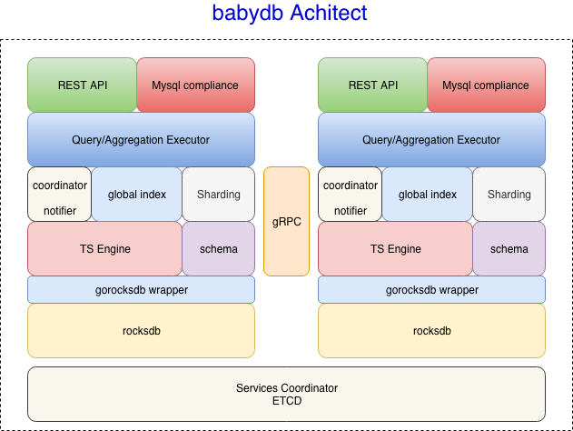

# babydb
BabyDB is experimental time serie database.

## Architect

## Components
### TS Engine
1. Get, Put, and Indexing.

### Schema
1. Data structure

### Coodinator & Notifier
1. Service notice, find
2. Rebalance

### Global index

### Sharding

### 
